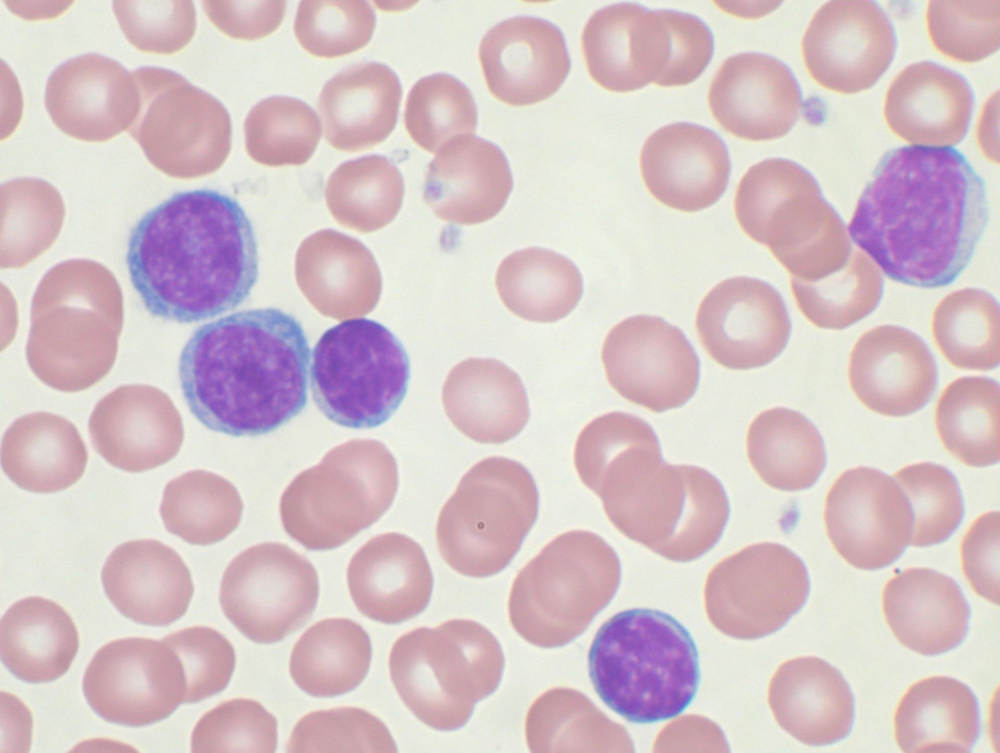

# SystemsBiology2021_IntegrationPractical
Practical for [Systems biology: From large datasets to biological insight 2021](https://www.ebi.ac.uk/training/events/systems-biology-large-datasets-biological-insight/) course at EMBL-EBI

This practical is a shortened version of the [group project](https://github.com/Manikgarg/MultiOmicsDataIntegrationCourse2021) I offered in the [Introduction to multiomics data integration and visualisation](https://www.ebi.ac.uk/training/events/introduction-multiomics-data-integration-and-visualisation-0/) course organized by EMBL-EBI in 2021 and 2020. A half an hour lecture video will be provided before the practical which introduces the methods Joint and Individual Variation Explained (JIVE)1 and Multi-omics factor analysis (MOFA)2. These methods along with 7 others were extensively benchmarked by Cantini *et al* (2021)3 where they found that JIVE and MOFA were among the four methods that outperformed others in finding factors selectively associated with clinical annotations. We extend this benchmark to [chronic lymphocytic leukemia](https://en.wikipedia.org/wiki/Chronic_lymphocytic_leukemia) (CLL) data from Dietrich *et al* (2018)4 which has missing values and different data type for different modality such as count data and binary data. 

## Dataset

The CLL dataset taken from Dietrich *et al* (2018)4 contains the following information from 200 patients:

- somatic mutations (69 x 200)
- RNA expression data (5000 x 136)
- DNA methylation (4248 x 196)
- ex vivo drug response (310 x 184)

## Take-away

At the end of the practical, the participants will

* get hands-on experience in using 2 multi-omics data integration tools on real-world data
* check if any of the methods capture biologically meaningful information and consequently identify relevant factors
* learn one of the metrics to select one method over the other

## Schedule

13:30 - 13:45: [0:15] Recap and intro to practicals\
13:45 - 14:00: [0:15] Q&A\
14:00 - 15:30: [1:30] Data exploration and models’ training\
15:30 - 15:45: [0:15] *Break*\
15:45 - 16:30: [0:45] Association with clinical annotations

## References

1. Lock, Eric F., et al. "Joint and individual variation explained (JIVE) for integrated analysis of multiple data types." The annals of applied statistics 7.1 (2013): 523. http://doi.org/10.1214/12-aoas597
2. Argelaguet et al. 2018. MOFA: a framework for unsupervised integration of multi-omics data sets. Mol Sys Bio. https://www.embopress.org/doi/10.15252/msb.20178124
3. Cantini, L., Zakeri, P., Hernandez, C. et al. Benchmarking joint multi-omics dimensionality reduction approaches for the study of cancer. Nat Commun 12, 124 (2021). https://doi.org/10.1038/s41467-020-20430-7
4. Dietrich, Sascha, et al. "Drug-perturbation-based stratification of blood cancer." The Journal of clinical investigation 128.1 (2018): 427-445.
5. Argelaguet, R., Arnol, D., Bredikhin, D. et al. MOFA+: a statistical framework for comprehensive integration of multi-modal single-cell data. Genome Biol 21, 111 (2020). https://doi.org/10.1186/s13059-020-02015-1

## Recommended watching

If you prefer watching videos over reading papers.

* [Laura Cantini – Benchmarking of computational approaches to multi-omics data analysis](https://network.febs.org/videos/talk2_laura-cantini)
* [Ricard Argelaguet - MOFA overview (VIB workshop 2021)](https://www.youtube.com/watch?v=_BfHeZ0s2i0)

